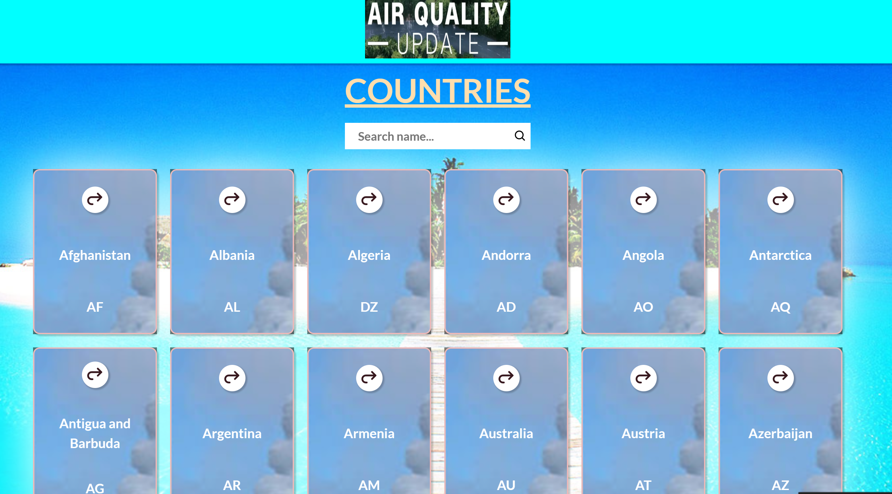

<a name="readme-top"></a>

<!--
HOW TO USE:
This is an example of how you may give instructions on setting up your project locally.

Modify this file to match your project and remove sections that don't apply.

REQUIRED SECTIONS:
- Table of Contents
- About the Project
  - Built With
  - Live Demo
- Getting Started
- Authors
- Future Features
- Contributing
- Show your support
- Acknowledgements
- License

OPTIONAL SECTIONS:
- FAQ

After you're finished please remove all the comments and instructions!
-->

<!-- TABLE OF CONTENTS -->

# 📗 Table of Contents

- [📗 Table of Contents](#-table-of-contents)
- [📖 \[Air Qaulity Update\] ](#-air-qaulity-update-)
  - [Screenshots](#screenshots)
  - [🛠 Built With ](#-built-with-)
    - [Tech Stack ](#tech-stack-)
    - [Key Features ](#key-features-)
  - [🚀 Live Demo ](#-live-demo-)
  - [💻 Getting Started ](#-getting-started-)
    - [Prerequisites](#prerequisites)
    - [Setup](#setup)
    - [Install](#install)
    - [Usage](#usage)
    - [Run tests](#run-tests)
    - [Deployment](#deployment)
  - [👥 Author ](#-author-)
  - [🔭 Future Features ](#-future-features-)
  - [🤝 Contributing ](#-contributing-)
  - [⭐️ Show your support ](#️-show-your-support-)
  - [🙏 Acknowledgments ](#-acknowledgments-)
  - [📝 License ](#-license-)

<!-- PROJECT DESCRIPTION -->

# 📖 [Air Qaulity Update] <a name="about-project"></a>

**Air Qaulity Update** is a mobile web application that allows users to view the air qaulity of countries. The wepapp has two pages: the home page and the details page.
The home page displays a list of countries that could be filtered by country name. When the user clicks (or taps) on a country, the application navigates to the details page.

## Screenshots



## 🛠 Built With <a name="built-with"></a>

### Tech Stack <a name="tech-stack"></a>

- React
- Redux
- Redux-router
- Linters (ESLint, Stylelint)
- Jest

<!-- Features -->

### Key Features <a name="key-features"></a>

- **Home page that will display Countries**
- **Details page for detailed item**
- **Back button to navigate to the home page**

<p align="right">(<a href="#readme-top">back to top</a>)</p>

<!-- LIVE DEMO -->

## 🚀 Live Demo <a name="live-demo"></a>

- [Live Demo Link](https://clinquant-faun-d0d0e9.netlify.app/)
- [Loom](https://www.loom.com/share/18c6a72e65074e6196901c079345fddc)

<p align="right">(<a href="#readme-top">back to top</a>)</p>

<!-- GETTING STARTED -->

## 💻 Getting Started <a name="getting-started"></a>

To get a local copy up and running, follow these steps.

### Prerequisites

In order to run this project you need:

```sh
  a browser
  a code editor
```

### Setup

Clone this repository to your desired folder:

```sh
  cd your-folder
  git clone https://github.com/uchexm/air-qaulity-update
```

-

### Install

Install this project with:

```sh
  cd air-qaulity-update
  npm install
```

-

### Usage

To run the project, execute the following command:

```sh
  npm run build
  npm start
```

-

### Run tests

To run tests, run the following command:

```sh
  npm test
```

-

### Deployment

You can deploy this project using:

```sh
npm start
```

<p align="right">(<a href="#readme-top">back to top</a>)</p>

<!-- AUTHORS -->

## 👥 Author <a name="authors"></a>

👤 **Uchechi Nwaka**

- GitHub: [@uchexm](https://github.com/uchexm)
- Twitter: [@nwakauc](https://twitter.com/nwakauc)
- LinkedIn: [@Uchechi Nwaka](https://www.linkedin.com/in/nwakauc/)

<p align="right">(<a href="#readme-top">back to top</a>)</p>

<!-- FUTURE FEATURES -->

## 🔭 Future Features <a name="future-features"></a>

- [ ] **Home page that will display list of countries and capital**
- [ ] **Details page for more detailed item**
- [ ] **Capital city page**

<p align="right">(<a href="#readme-top">back to top</a>)</p>

<!-- CONTRIBUTING -->

## 🤝 Contributing <a name="contributing"></a>

Contributions, issues, and feature requests are welcome!

Feel free to check the [issues page](<[../../issues/](https://github.com/uchexm/air-qaulity-update/issues)>).

<p align="right">(<a href="#readme-top">back to top</a>)</p>

<!-- SUPPORT -->

## ⭐️ Show your support <a name="support"></a>

If you like this project please give it a ⭐️

<p align="right">(<a href="#readme-top">back to top</a>)</p>

<!-- ACKNOWLEDGEMENTS -->

## 🙏 Acknowledgments <a name="acknowledgements"></a>

I would like to thank [Nelson Sakwa](<https://www.behance.net/gallery/31579789/Ballhead-App-(Free-PSDs)>) on Behance for the design inspiration.

<p align="right">(<a href="#readme-top">back to top</a>)</p>

<!-- LICENSE -->

## 📝 License <a name="license"></a>

This project is [MIT](MIT.md) licensed.

_NOTE: we recommend using the [MIT license](https://choosealicense.com/licenses/mit/) - you can set it up quickly by [using templates available on GitHub](https://docs.github.com/en/communities/setting-up-your-project-for-healthy-contributions/adding-a-license-to-a-repository). You can also use [any other license](https://choosealicense.com/licenses/) if you wish._

<p align="right">(<a href="#readme-top">back to top</a>)</p>
